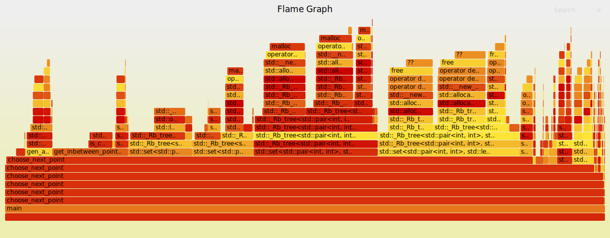

# What is the number of possible combinations in the Android pattern ?

This project is a fun experiment aiming at determining how many valid pattern combinations exist for the Android lock, while learning how to optimise python programs for performance with large data

These tests were made on an ArchLinux system with kernel 6.7.0 and python 3.11.6

## Attempt 1
Naive implementation in Python. Works for size=3 but not for size=4 (way too slow)

time for size=3 -> 8.6s

## Attempt 2

I used [flame graphs](https://brendangregg.com/flamegraphs.html) to determine what was taking so long in the program. Using the screenshot below, I found out that `to_number()` was taking way to much time. After optimising it, the program was faster

(To generate flame graphs, I use this command: `python -m cProfile -o out.prof attempt1.py && flameprof --format=log out.prof | flamegraph > attempt1.svg`. You may need to install packages)

Before

After (3.6s for size=3)

## Attempt 3
According to the flame graph, the next thing that was taking too much time was `__eq__()`, but I wasn't doing class comparison in my code. Searching online, I found out that it was the list contains operator (`in`) that was doing that, because lists aren't hash-based. Following https://stackoverflow.com/a/53657523 I replaced my list with a dict, and the program was faster (2.4s for size=3)

## Attempt 4
The next thing I wanted to optimise was `genAllPoints()`, because it was a really special function, in that it wasn't doing any logic. I remembered that I had performance problems with classes in python in the past, and sure enough, that was it. Removing the Point class (and optimising even more the corresponding value put in the `result` set) made the program run faster (1.6s for size=3)

## Attempt 5
Really small modification: using itertools instead of manual for-loops for generating points
Speed is now 1.5s for size=3

## Attempt 6
Using a dict as a hash list with insertion order felt unclean, and the only reason we needed to keep insertion order was to be able to insert all possible patterns in a set for deduplication. I handled the deduplication directly in the logic by disallowing going to points which would require new intermediate points to be marked as visited, so no need for keeping insertion order anymore.

Speed is now 0.65s for size=3
Note: at some point I also tried my own hash structure: a list of size SIZE*SIZE, with visited point indexes set to True. With this, speed was of 0.8s for size=3

## Attempt 7
At this point I wasn't sure what to optimise anything, so I tried porting it in different languages:
- Rust
- Go
- C++
I also used numba to accelerate the code

All of these results were pretty fast for size=3, so I changed the config: from now on, I will test 4x4, but only for patterns of size <= 7

Results:

Python + numba, speed was 3.5s

Rust, speed was 1.5s

Go, speed was 4.5s

C++ with g++ and -O3, speed was 2.2s

Note:
g++ (classic): 17.6s,
g++ (-O3): 2.2s,
clang++ (classic): 15.7s,
clang++ (-O3): 2.3s
