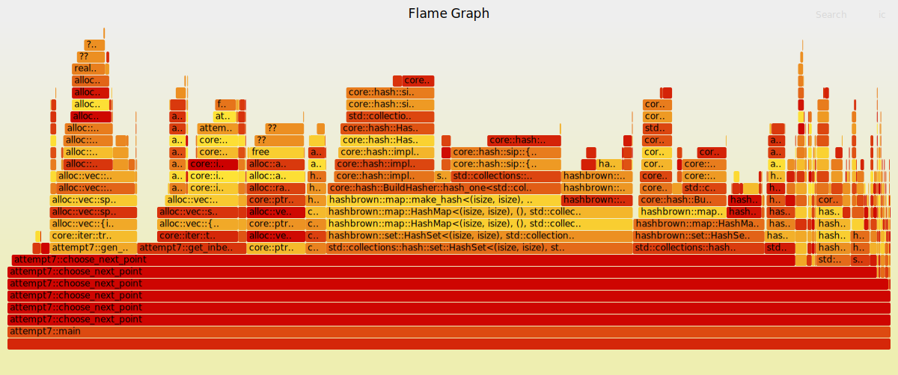
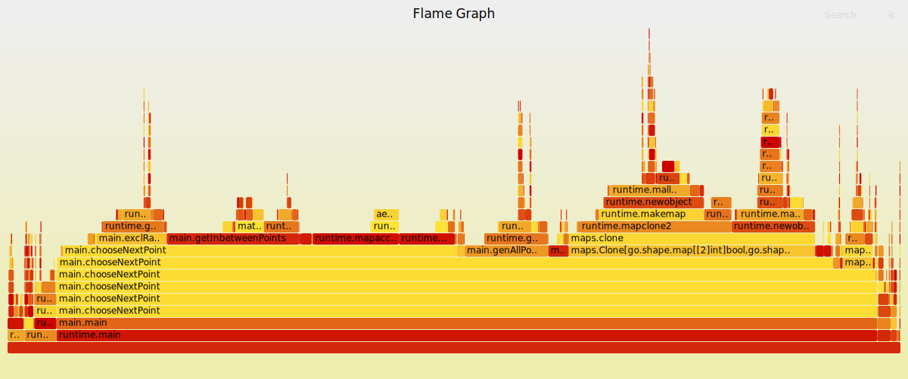
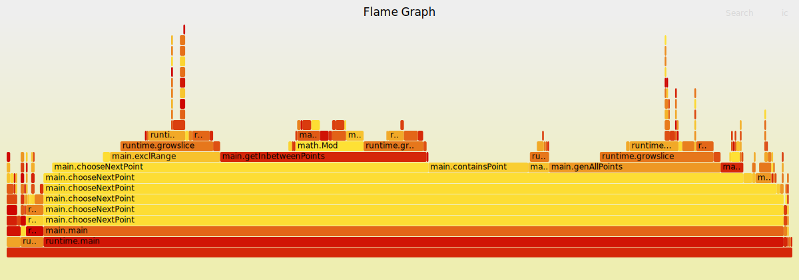

# What is the number of possible combinations in the Android pattern ?

This project is a fun experiment aiming at determining how many valid pattern combinations exist for the Android lock, while learning how to optimise python programs for performance with large data

These tests were made on an ArchLinux system with kernel 6.7.0 and python 3.11.6

Attempts guidelines:
- Each attempt is about one (or more) specific optimisation(s)
- Each attempt modifies the scripts in all languages in the same way
- I can modify earlier attempts to fix small errors/opportunistic optimisations if needed. If the resulted time is improved by a lot (e.g. beats the time of the next attempt) it should probably go into a new attempt at the end

## Attempt 1: naive
Naive implementation in Python. Works for size=3 but not for size=4 (way too slow)

time for size=3 -> 8.6s

## Attempt 2: to_number()

I used [flame graphs](https://brendangregg.com/flamegraphs.html) to determine what was taking so long in the program. Using the screenshot below, I found out that `to_number()` was taking way to much time. After optimising it, the program was faster

(To generate flame graphs, I use this command: `python -m cProfile -o out.prof attempt1.py && flameprof --format=log out.prof | flamegraph > attempt1.svg`. You may need to install packages)

Before

After (3.6s for size=3)


## Attempt 3: sets instead of arrays
According to the flame graph, the next thing that was taking too much time was `__eq__()`, but I wasn't doing class comparison in my code. Searching online, I found out that it was the list contains operator (`in`) that was doing that, because lists aren't hash-based. Following https://stackoverflow.com/a/53657523 I replaced my list with a dict, and the program was faster (2.4s for size=3)


## Attempt 4: remove classes
The next thing I wanted to optimise was `genAllPoints()`, because it was a really special function, in that it wasn't doing any logic. I remembered that I had performance problems with classes in python in the past, and sure enough, that was it. Removing the Point class (and optimising even more the corresponding value put in the `result` set) made the program run faster (1.6s for size=3)


## Attempt 5: itertools
Really small modification: using itertools instead of manual for-loops for generating points
Speed is now 1.5s for size=3


## Attempt 6: remove main set for keeping track of possibilities
Using a dict as a hash list with insertion order felt unclean, and the only reason we needed to keep insertion order was to be able to insert all possible patterns in a set for deduplication. I handled the deduplication directly in the logic by disallowing going to points which would require new intermediate points to be marked as visited, so no need for keeping insertion order anymore.

Speed is now 0.65s for size=3
Note: at some point I also tried my own hash structure: a list of size SIZE*SIZE, with visited point indexes set to True. With this, speed was of 0.8s for size=3


## Attempt 7: Try in other languages
At this point I wasn't sure what to optimise anything, so I tried porting it in different languages:
- Rust
- Go
- C++
I also used numba to accelerate the code

All of these results were pretty fast for size=3, so I changed the config: from now on, I will test 4x4, but only for patterns of size <= 7

Note that for the Rust and C+ flamegraphs, I used the https://github.com/jasonrohrer/wallClockProfiler profiler. You will need to apply the following patches to the setup:
- https://github.com/brendangregg/FlameGraph/pull/331
- https://github.com/jasonrohrer/wallClockProfiler/pull/10

Results:

### Normal Python
speed was 18.4s

### Python + numba
speed was 3.5s

### Rust
speed was 1.8s

flamegraph generated using
```sh
cargo build --release
wallClockProfiler 500 target/release/attempt7_cpp > out.txt
stackcollapse-wcp.pl out.txt | flamegraph.pl > attempt7.svg
```


### Go
speed was 8.6s

flamegraph was generated using
```sh
go run . --cpuprofile cpu.txt.tmp
go tool pprof -raw cpu.txt.tmp | stackcollapse-go.pl | flamegraph.pl > attempt7.svg
```


### C++
g++ and -O3, speed was 2.2s

flamegraph generated using
```sh
wallClockProfiler 500 ./attempt7_cpp > out.txt
stackcollapse-wcp.pl out.txt | flamegraph.pl > attempt7.svg
```

Note:
g++ (classic): 17.2s,
g++ (-O3): 2.2s,
clang++ (classic): 15.6s,
clang++ (-O3): 2.3s

## Attempt 8: arrays instead of sets
While implementing the earlier algorithms, I mistakenly implemented an array (Vec) in Rust rather than a set. When correcting the mistake, I noticed that the set solution was slower (note that in Attempt 3 I replaced arrays with sets for a performance gain !).

So here I am now, replacing sets with arrays. Every script had a performance gain, Go and C++ in particular.

Python + numba: 3.3s

Rust: 1.5s


Go: 3.8s


C++: 1.0s


## Attempt 9: use push/pop instead of clone/push
In this attempt, I saw that for the Rust script, a big part of the time was spent doing Vec::push(). The only time when this method is called is when adding the new points when doing recursive calls. I had already noticed earlier that I could try to have a stack-based system instead of cloning/pushing, so I did that. That indeed resulted in a performance boost. Unfortunately, I wasn't able to optimise the Go script, because arrays in Go are weird, I'm not even sure if there is something I can optimise there (but probably, seeing the time differences).

The speed gain is probably caused by the fact .clone() allocates just enough space for the current array size, so when you do .push() just after, you are reallocating everything. And indeed using https://users.rust-lang.org/t/best-way-to-clone-and-append-a-single-element/68675 (
```rs
let mut b = Vec::with_capacity(a.len() + 1);
b.clone_from(&a);
b.push(item);
```
) to add one more element to the capacity brings speed to 0.95s. The remaining difference is probably caused by .clone()

Python + numba: 1.7s

Rust: 0.7s


Go: 3.7s


C++: 0.69s


## Note: at this point I made a x570 speed improvement (Going from 4m39 (399s) in attempt 1 to 0.7s in attempt 9 for size 4 and max size 7)

From now on, I (think I ?) will only update the Rust script, to be able to iterate quicker

## Attempt 10: run Rust `gen_all_points()` at compile-time
I couldn't make a cleaner solution, see https://discord.com/channels/172018499005317120/364870796830703627/1209812638582968350

Time went to 0.48s


## Attempt 11: Remove allocations of `get_inbetween_points()`

With thee suggestion of `_haddock_` on discord, I made `get_inbetween_points()` act as a generator lazily outputting values rather than allocating a Vec<>

Time went to 0.432s


At this point, speeds were starting to be too small to work with, so I increased `MAX_LEN` to 8, giving me a speed of 3.313s

## Attempt 12: Add cache to `get_inbetween_points()`

Another suggestion of `_haddock_` was to add cache to `get_inbetween_points()`, to avoid repeated calls for the same input points.

I implemented this while trying to keep the modifications of attempt 11 (visit earlier commits to see it, see next line for explanation). Speed didn't really change: it went to 3.314s

I wasn't really convinced with the Iterator approach with the cache, so I tried replacing them with vectors (this is the version currently shown in the code. Visit earlier commits for the iterator approach). Time once again didn't change (3.290s)

Next attempts will use attempt 11 as a base